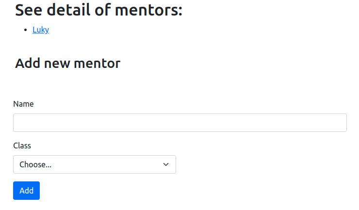
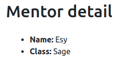

# Mentor Scheduler

We are going to create the **base** of our very own tool to store which mentors
are placed in which class to avoid confusion in the future.

## Database

It is up to you to define what the database model will look
like, it just needs to help fulfill outlined functionality.

For purposes of this project, each mentor can only be located
in one class at a time.

Only requirements are:

* all the mentor and class data needs to be stored in database
* mentors and classes will be stored in separated tables
* there will be some relationship between these tables

An example database can be found [here](./assets/mentor_schedule.sql)

## GET `/`



- The main page should be rendered

- It should list the mentors that are already in the database as links

- The mentor links should point to GET `/mentor/{id}`

- To be able to extend the list of mentors, we should include a form
  on the main page as well

- The form should contain:

  - One input field for name with label

  - Dropdown, with each option corresponding to one of the existing
    classes that will assign mentor to this class

- The form should be submitted to POST `/mentor`


## POST `/mentor`

- Save the mentor in the database

- Redirect to the page of the given mentor
  GET `/mentor/{id}`

## GET `/mentor/{id}`



- The page should render the details of the mentor that is specified in the path

- It should include:

  - The name of the mentor
  - Which class he/she belongs to

- When the mentor with the given ID does not exist, give a 404 page with the message: "Mentor not found"

## GET `/api/mentors?className={className}`

- Class name in the URL is required
- When className is not given then it should return `400` status code
- This endpoint should respond in JSON format with mentors
- Example `api/mentors?className=really`

  ```json
  [
    {
      "name": "Gabor"
    },
    {
      "name": "Szirmi"
    },
    {
      "name": "Bence"
    }
  ]
  ```

- When className is not found in the database then it should return `200` status code
  and the response should be an empty array in JSON format

  ```json
  []
  ```

## POST `/api/mentors`

- This endpoint should create a new mentor
- The name and class should be in the request's body in JSON format, this is how
  we will be able to create a new mentor

  ```json
  {
    "name": "Gábor",
    "className": "Tiptop"
  }
  ```

- When className is not found in the database, then the application should respond with
  `400` status code and following message:

  ```json
  {
    "message": "Class not found"
  }
  ```
- When mentor is already in the database, then the application should respond with
  `400` status code and following message:

  ```json
  {
    "message": "Mentor already exists"
  }
  ```
- When mentor is successfully created, then the application should respond with
  `201` status code and following message:

  ```json
  {
    "id": 1,
    "name": "Gábor",
    "className": "Tiptop"
  }
  ```


## PUT `/api/mentors/{mentorId}`

- This endpoint should update the mentor specified by `mentorId`

- The name and class should be in the request's body in JSON format, this is how
  we will be able to modify its values

  ```json
  {
    "name": "Gábor",
    "className": "Tiptop"
  }
  ```

- When className is not found in the database, then the application should respond with
  `400` status code and following message:

  ```json
  {
    "message": "Class not found"
  }
  ```

- When mentor is not found by `mentorId` in the database, then the application must respond
  with `404` status code and following message:

  ```json
  {
    "message": "Mentor not found"
  }
  ```

## Question

You are working with following SQL table of 10 outstanding videogames:

| id | name                     | genre      | releaseDate | developer              | engine            | price | rating |
|---:|:-------------------------|:-----------|------------:|:-----------------------|:------------------|------:|-------:|
|  1 | The Witcher 3: Wild Hunt | RPG        |  2015-05-19 | CD Projekt Red         | REDengine 3       |  1499 |    9.2 |
|  2 | Half-Life 2              | FPS        |  2004-11-16 | Valve                  | Source            |   299 |    8.7 |
|  3 | The Sims                 | Simulation |  2000-01-31 | Maxis                  | Custom            |   199 |      9 |
|  4 | BioShock                 | FPS        |  2007-08-21 | 2K                     | Unreal Engine 2.5 |   350 |    9.1 |
|  5 | BioShock: Infinite       | FPS        |  2013-03-26 | Irrational Games       | Unreal Engine 3   |   699 |    8.4 |
|  6 | Quake                    | FPS        |  1996-07-22 | id Software            | Quake engine      |   299 |    8.6 |
|  7 | Diablo                   | RPG        |  1996-12-31 | Blizzard North         | DEngine           |   299 |    8.9 |
|  8 | World of Warcraft        | MMORPG     |  2004-11-23 | Blizzard Entertainment | Custom            |   499 |    8.8 |
|  9 | Grand Theft Auto V       | Advenure   |  2013-09-17 | Rockstar North         | RAGE              |   899 |    8.8 |
| 10 | Undertake                | Roleplay   |  2015-09-15 | Toby Fox               | GameMaker Studio  |   399 |    9.1 |

`1.` Write SQL query to create the table

```mysql

```

`2.` Write SQL query to insert one row of data

```mysql

```


`3.` Write SQL query that will return top 2 rated FPS game's
titles and developers

```mysql

```


`4.` Write SQL query that will make every game released in 20th century
go on sale (reduce its price by 200)

```mysql

```
